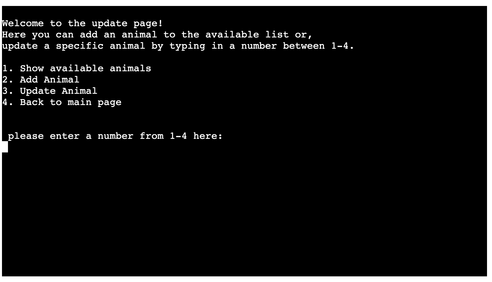
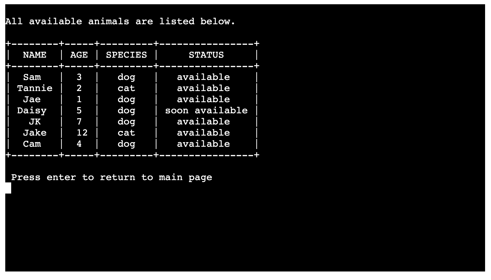
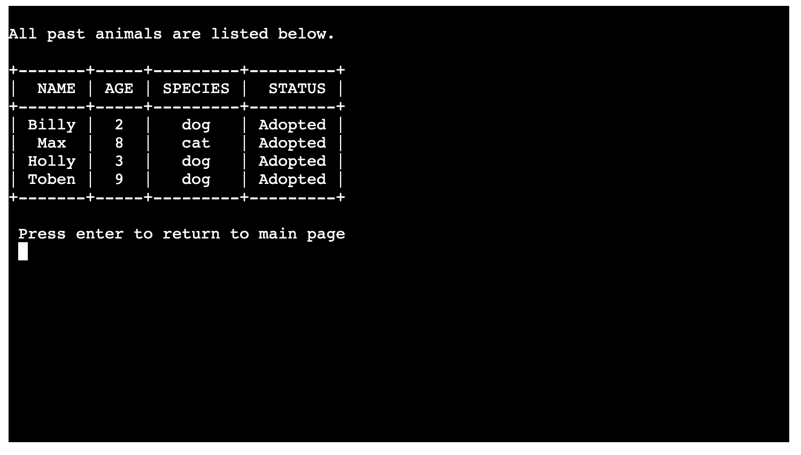
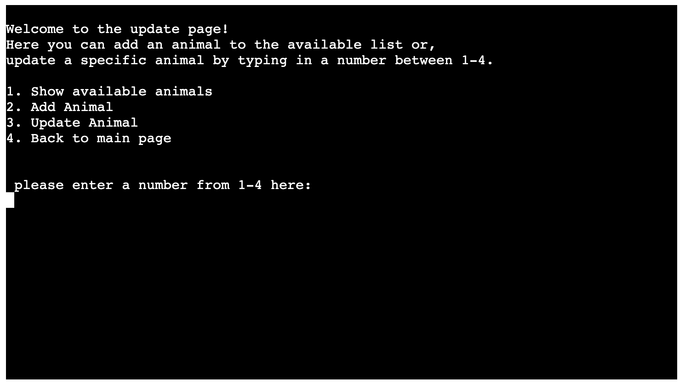
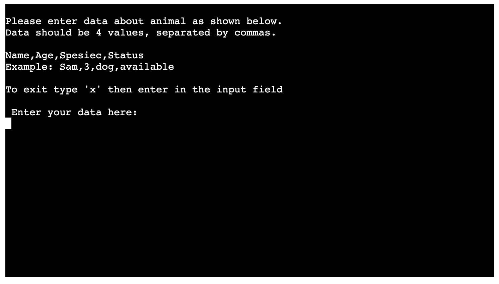
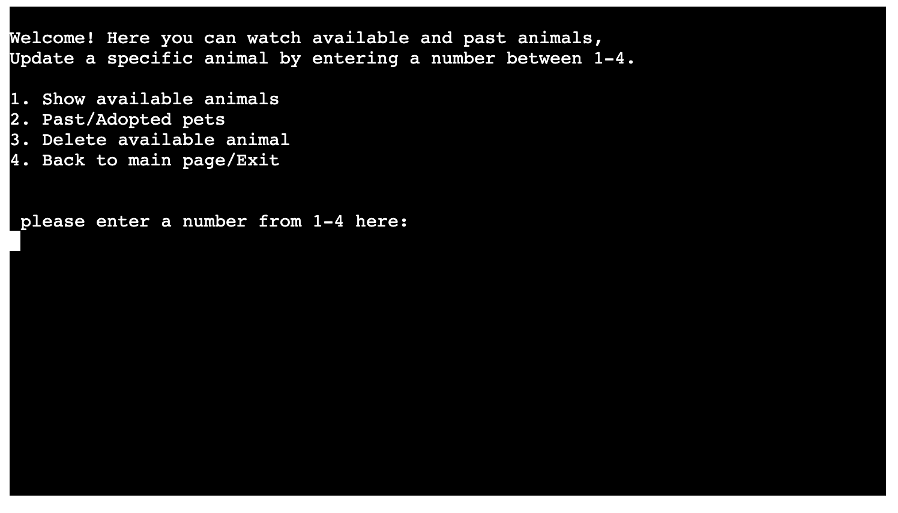
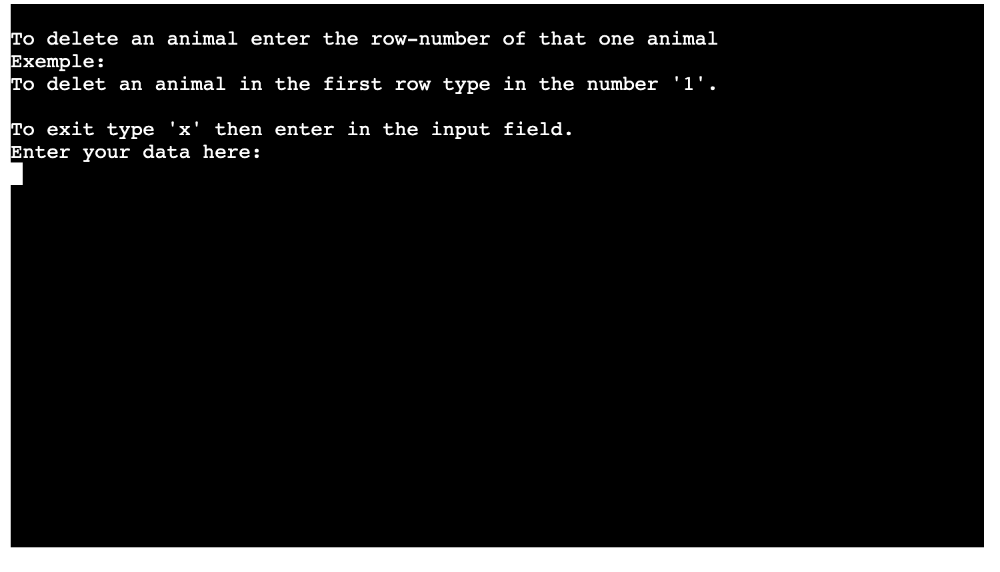
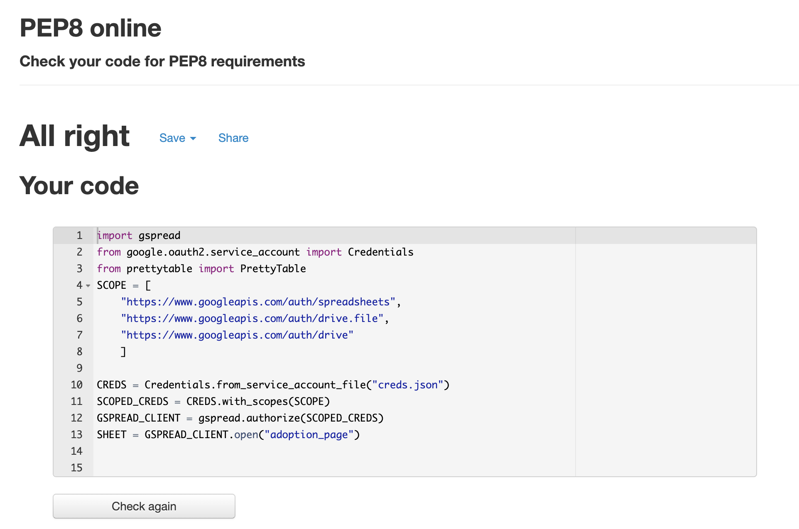
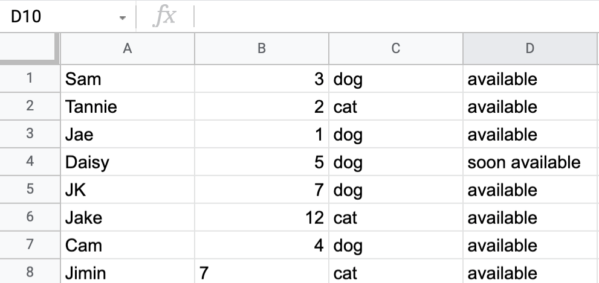
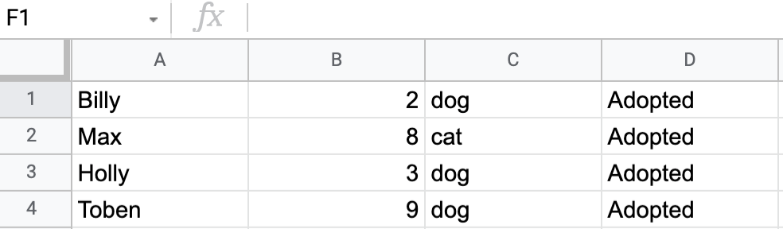

# Adoption page

## **About**
---

The adoption page is an application for adoptions runners to keep track of their organization. 

The user can show and interact with the available information on what animals they have available and what they have had in the past. They can add and remove a specific animal by using the application.

## **User Experience (UX)**
---

* Easily navigate between the different functions available in the application.

* View information on available animals in the available spreadsheet.

* View information on past animals in the past spreadsheet.

* Be able to add an animal into the available spreadsheet.

* If needed, remove an animal from the available spreadsheet. 

## **Features**
---
### Existing Features

---

#### Home page
---

The home page has an introduction at the top and below three options to choose from by entering a number in between 1-4.
The options are:

* Show available animals
* Past/Adopted pets
* Update

#### Show available animals
---

If the user chooses to enter the number 1 in the input field, The application will show a table of all available animals and their information for the client to look through.
If the user wishes to return to the home page they can press enter.

#### Past/Adopted pets
---

If the user chooses to enter the number 2 in the input field, The application will show a table of all past/adopted animals and their information for the client to look through.
If the user wishes to return to the home page they can press enter.

#### Update
---

If the user chooses to enter the number 3 in the input field, The application will take them to another part of the application where they are met with 4 options again.
the options are: 

* Show available animals
* Add animal
* Update animal
* Back to the main page

#### Show available animals
---

If the user chooses to enter the number 1 in the input field, The application will again show the table of all available animals and their information for the client to look through.
If the user wishes to return to the home page they can press enter.

#### Add animal
---

If the user chooses to enter the number 2 in the input field, The application will take them to the add animal page. Here the application explains how the user should type in their answer if they want to add an animal to the available spreadsheet.
If the user wishes to return to the previous page they can type in an "x" and press enter.

#### Update animal
---

If the user chooses to enter the number 3 in the input field, The application will take them to the Update animal page. Where the application will give them 4 options to choose from. The first two options are the same as on the home page. If they enter 4 as an input they will be taken back to the home page

#### Delete animal
---

If the user chooses to enter number 3 as the input number they will be taken to the section where they have the ability to delete an animal from the available spreadsheet. The user can delete an animal by typing the row number of that specific animal.
If the user wishes to return to the previous page they can type in an "x" and press enter.

### Features that could be implemented in the future
---

* Moving between sheets
    * This application has no way of moving the data from the available sheet to the past sheet when an animal has been adopted. This is a major thing for things to be implemented in the future.

* Application
    * There would be useful for the client to have a way of tracking the applicants who want to adopt an animal in a spreadsheet. 
        * This can be done by creating an option for the applicants to apply for an available animal. 

## **Validator Testing**
---
### Python validator (PEP8)

The application was tested with pep8 and after a few changes passed the test without any errors. 

* The main errors were blank spaces and white lines.
    * These were fixed by removing them from the code.

## **Deployment**
---

### Github pages
---

1. Create an account and log in on GitHub.
2. Create a repository.
3. Make commit messages and push your code to GitHub throughout when you code.
4. When you are done, go into settings in GitHub (in your repository).
5. Scroll down to GitHub pages.
6. In the source section select branch (this project selected main) and save.
7. Refresh the page and when it is successfully deployed, The message Your site is published at... will show beside the link to your site.

### Heroku
---

1. You need to have an account on Heroku.com
2. Create a list of requirements that the project needs to run:
    * Type in this in the terminal: pip3 freeze > requirements.txt
    * (Now all of the requirements has been updated) 
    * Commit and push the changes to GitHub
3. login to your account on Heroku or create one if needed.
4. Click on your profile and then the "create new app" button.

5. You will now create an app name and select a region.
    * This project chose adopt-page and the region Europe
    * The app name needs to be unique
6. when this is done click "create app"

7. Open the settings tab before you deploy the code.
8. In setting, scroll down to the config Vars section
9. The Heroku application is separated from Gitpod workspace and can not access the spreadsheet, it needs to have the contents of the json file.
10. To do this you create a config var by pressing "Reveal Config Vars" 
11. In the KEY field, you enter the name (All capital letters)of the json file and in the VALUE field go back to your json file and copy everything in there.
12. Paste this in the VALUE field.
13. Click Add.
14. You do also need to add another KEY and VALUE for the deplyment to work.
    * The key is PORT and value 8000.
15. After that, you need to add the Buildpacks used for the application.
    * This project used "python" and "nodejs".
16. Choose the Buildpack and click save.
17. Make sure that the Buildbacks are in the correct order, python over nodejs.
18. Go over to the deploy section.
19. Select GitHub as the Deployment method and connect it to Github.
20. Enter your password and give Heroku access.
21. In the Connect to GitHub section search for your repository name.
22. Click connect to link the Heroku app to the GitHub repository code.

The last thing you need to do is to choose how you want to deploy,
pick a branch to deploy and then click the deploy branch button.

## **Credits**
---

### content
---
The contents used for the application is data from the spreadsheets down below:

Available sheet, Example:

Past sheet, Example:

### code
---

* All code is from my knowledge of doing the Codeinstitute Full Stack Developer Course.
* I have used everything that I have learned from doing the course, the mentor sessions, and my past experience with python.

### Acknowledgments
---
* My Mentor for guiding me throughout the process.
